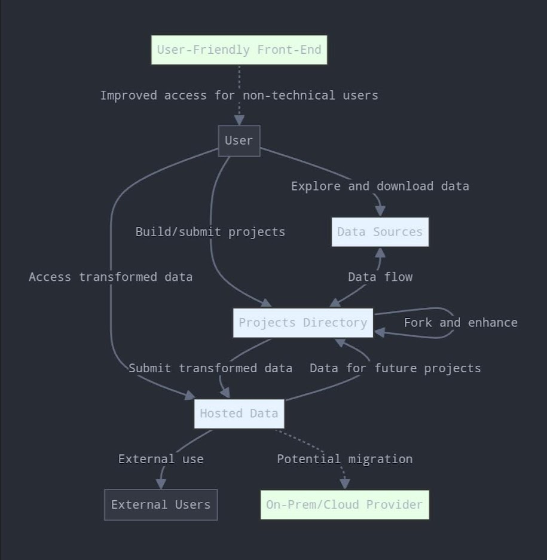

# DEP Data Hub

Welcome to the DEP Data Hub, an open and collaborative platform for data sources, data-driven projects, and hosted datasets.

## About

DEP Data Hub serves as a comprehensive index of data sources, a showcase for data-driven projects, and a repository for hosted datasets. Our mission is to empower communities through data collaboration and innovation by connecting data professionals, researchers, policymakers, and enthusiasts with valuable data resources and impactful projects.

## Repository Structure

- `data-sources/`: A curated list of external data sources with links and descriptions.
- `projects/`: Showcases data-driven projects and analyses.
- `hosted-data/`: Contains datasets directly hosted in this repository.

## Data Flow and User Interaction

The following diagram illustrates how users interact with different components of the DEP Data Hub and how data flows through the system:

## How to Use the Data Hub

1. Navigate to the relevant directory (`data-sources`, `projects`, or `hosted-data`).
2. Browse through the README files or use GitHub's search function to find what you need.
3. Each entry includes descriptions, methodologies, and instructions on how to access or use the data or project.

## Contributing

We welcome contributions! Please check our [Contribution Guidelines](CONTRIBUTING.md) to get started.

## Get Involved

- 🌟 Star this repository to show your support
- 👀 Watch this repository to receive notifications for new entries
- 🗣 Join the discussion in our [GitHub Discussions](link-to-discussions)
- 🐛 Found an issue? [Let us know](link-to-issues)

## Future Plans

We're constantly evolving. Future plans include:
- Scaling our infrastructure to handle larger datasets
- Moving hosted data to cloud storage for improved performance
- Enhancing our data discovery and metadata management capabilities
- Integrating with data visualization tools for quick insights
- Developing an API for programmatic access to our data index

## New to GitHub?

If you're new to GitHub, here's a quick primer:

GitHub is a web-based platform that uses Git for version control. It's widely used in software development and, increasingly, in data science and other fields for collaboration and project management. Here's why it's valuable for data professionals:

1. **Collaboration**: Multiple people can work on the same project simultaneously.
2. **Version Control**: Track changes over time and revert to previous versions if needed.
3. **Issue Tracking**: Report and manage bugs, feature requests, and tasks.
4. **Documentation**: Easily create and maintain project documentation using Markdown.
5. **Community**: Share your work with a global community and contribute to others' projects.

We use GitHub for the DEP Data Hub because it provides robust version control, enables community contributions through pull requests, offers excellent search functionality, and aligns with our commitment to open data and transparency. While platforms like Google Drive or spreadsheets are user-friendly, they lack the version control and collaboration features that make GitHub ideal for managing and sharing code and data resources.

If you're new to GitHub, consider checking out GitHub's own [guides and tutorials](https://guides.github.com/) to get started.
